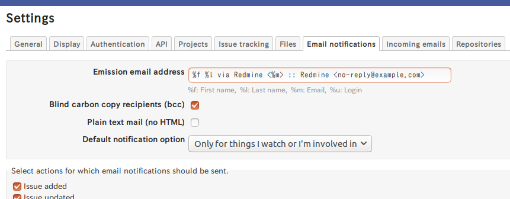

# Redmine Mail From plugin

This plugin adds user name and/or mail address to the "From:" header field of the notification mail.

This plugin works with Redmine 3.0.0 or later.

## Installation

1. Clone or copy files into the Redmine plugins directory
2. Restart Redmine

## Usage

Add `%f`, `%l`, `%m` and/or `%u` to the "Emission email address" field under the "Email notifications" tab in Redmine settings.

When a notification is sent, `%f`, `%l`, `%m` and `%u` are replaced with:
* `%f` - First name
* `%l` - Last name
* `%m` - Mail address
* `%u` - Login name

Multiple emission mail addresses can be specified.
The plugin tries to replace placeholders in the first one.
If fails, it tries the next one.

### Exmaple



If Axl Rose (a.rose@gnr.com) operates Redmine, the notification is sent with `From: Axl Rose via Redmine <a.rose@gnr.com>`.

The reminder or the notification by anonymous is sent with
`From: Redmine <no-reply@example.com>`.

### Notes

* `%m` is replaced with empty if the user preference "Hide my email address" is enabled.
* `%f`, `%m` and `%u` are replaced with empty if the user is anonymous.
* "List-Id" header field is replaced with `<project-id.host-name>`.
* Adjust the setting according to your environment.
In several cases, SMTP server may not allow the "From:" and "List-Id" header
fields generated by this plugin.
* If first/last name contains special characters (e.g. parentheses)
which is not allowed for mail display name, use double quotations as follows:
```
"%f %l via Redmine" <%m>
```

## License

This plugin is released under the terms of GNU General Public License, version 2.

## Author

Takeshi Nakamura
